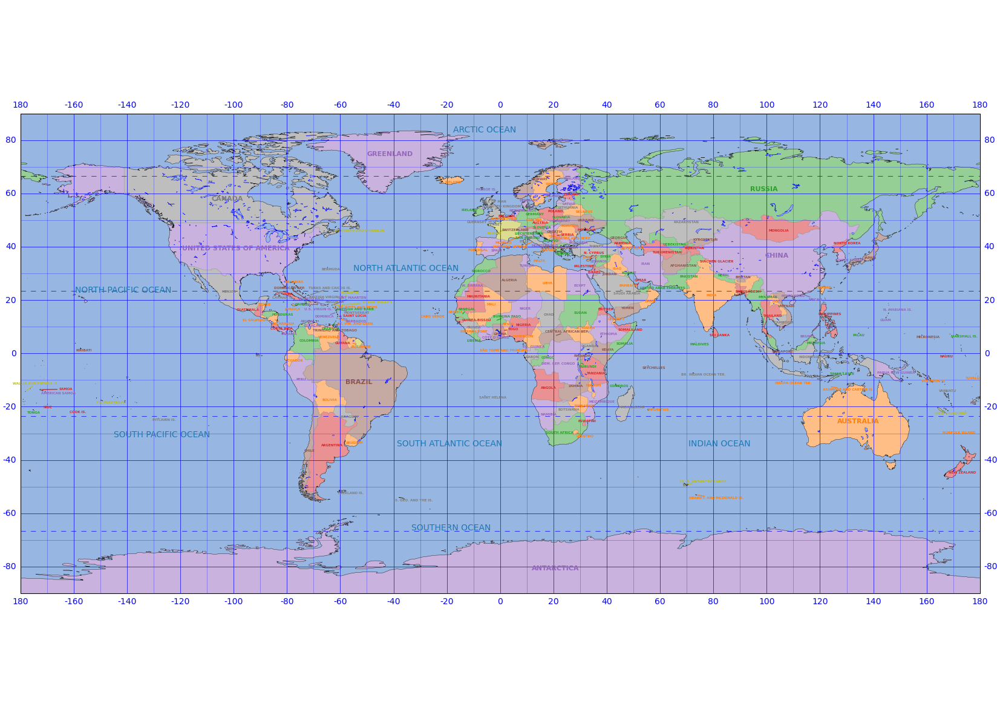

# Poster-quality world map using cartopy and matplotlib

## Depenencies
- `adjustText`
- `cartopy`
- `matplotlib`
- `python`
- `numpy`
- `shapely`

## Usage
1. Edit the configuration in `config.py`
2. `python world_map.py`
